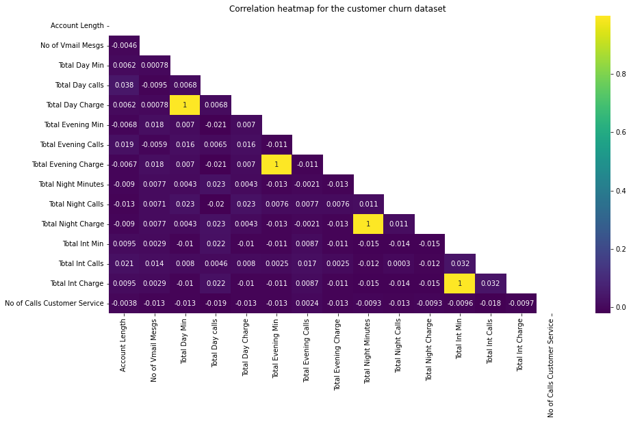
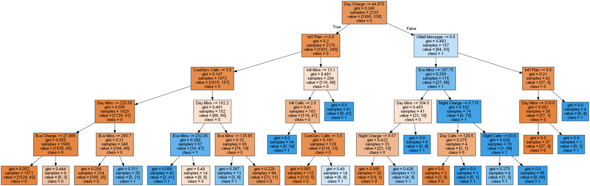
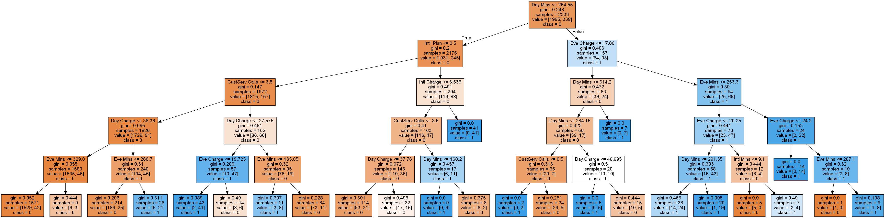

<h1 align="center">
  🚀 Predicting Customer Churn 💔
</h1>

<h3 align="center" style="color:#3498DB;">
  📊 Data-Driven Insights to Reduce Attrition & Boost Retention 📈
</h3>

---

  <h3 style="color: #4A90E2; font-family: 'Segoe UI', Tahoma, Geneva, Verdana, sans-serif;">
    👥 Project Team
  </h3>

  

    🧑‍💻 Ahmed, Shahzad
  

  

    👨‍💻 Chandra, Akash
  

  

    👩‍💻 Nguyen, Thi Ngoc Thanh
  

##   **Predicting Customer Churn** 

According to IBM (2020), “data science combines the scientific method, math and statistics, specialized programming, advanced analytics, AI, and even storytelling to uncover and explain the business insights buried in data.” 1 With the emphasis on using math & statistics, programming, domain knowledge as well as story-telling skills, data scientists are experts who use the above tools and domain knowledge to make sense of patterns, giving answers to any question business stakeholders may have, and/or going further to predict possible actions and their outcomes of those actions.

In this project, as a team of data scientists, our consultants are working together to solve a business problem for our client - a telecommunications company with a predictive analytics business problem. Based on historical data on the customers’ phone usage, the client would like to analyze and predict which customers will be likely to churn in the future. “Customer churn, also known as customer attrition, is when someone chooses to stop using your products or services” (Qualtrics, 2022).2 Most companies would want to control the average churn rate at a feasible level, as a high churn rate would impact brands, costs, customer engagement metrics (lower customer lifetime value (CLV) and higher customer acquisition costs (CAC) etc.), as well as the company’s long-term growth.

The ability to segment customers and predict the customer churn, through data analytics, machine learning & predictive modeling methods, would be a great business advantage for our client. Thus, this project aims to find a solution to our client’s “customer churn” business problem by Exploratory Data Analysis (EDA) and Predictive Modeling/Classification techniques (Classification using Decision Tree, Naïve Bayes). The dataset we are using is “churn.arff”. There are 3333 rows, 21 columns/attributes in this dataset.

##  **Code Magic**

[Project Code](https://github.com/shahgem/CIND-119/blob/main/Code/CIND119_DHC_Group1_Project_CustomerChurn.ipynb)

##  **Correlations**

##  **Decision Trees**

##   **Conclusions and Recommendations**

By far, the best predictive result for customer churn characterization and prediction comes from utilizing all the attributes in the dataset to build a decision tree classification model with an accuracy score of 92.7%. a precision rate of 0.76.

The decreasing performances going from using all features down to several selected features reflect a need to further investigate and select a better combination of selected features. This implies that choosing the suitable features is very important if we would like to enhance the outcome of this predictive analytics project. Carrying out iterative cycles of data-preprocessing and feature selection process may indeed improve our models’ performances. Another separate step of “Feature Evaluation” can be considered in which we rank which features play the most important role in the identification of customer churn. Probably, we can try applying RandomForestClassifier’s “feature_importance” to rank the most important features for a given classification.

Moreover, we also recommend exploring other predictive techniques such as K-Means in case they may yield more promising results for customer churn prediction.
